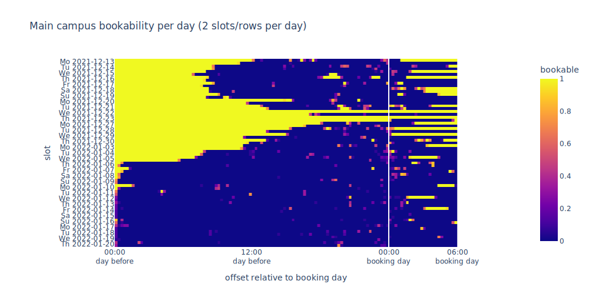

# TUM Library Checker

> Only for educational purposes

This repository contains a crawler to save bookings for [TUM libraries](https://www.ub.tum.de/en/reserve-study-desks) in a CSV file.

Sample data from *2021-12-11* to *2022-01-08* can be found [here](./sample_data). The data is very diverse due to the Christmas break.

The quick vizualization below can be found in [this notebook](./analysis.ipynb).




## How to run

Clone the repository.

(optional) Create a Python 3.9 virtual environment and source it.
```
python -m venv venv
source venv/bin/activate
```

Install requirements.
```
pip install -r requirements.txt
```

(optional) 
Create a custom *.env* file and edit it (otherwise, default values are used).
```
cp template.env .env
```
```
URL="https://www.ub.tum.de/en/reserve-study-desks"
DATA_PATH="data"
```

Run the crawler once. The CSV is saved in the data path directory.
```
python run_crawler.py
```

(optional) Create a cron job that runs the crawler periodically.
```
* * * * * REPO_PATH/venv/bin/python REPO_PATH/run_crawler.py
```


## TODO

- Analyse the data
- Create a bot to make reservations (only for educational purposes)

